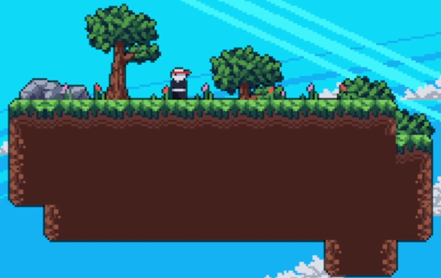
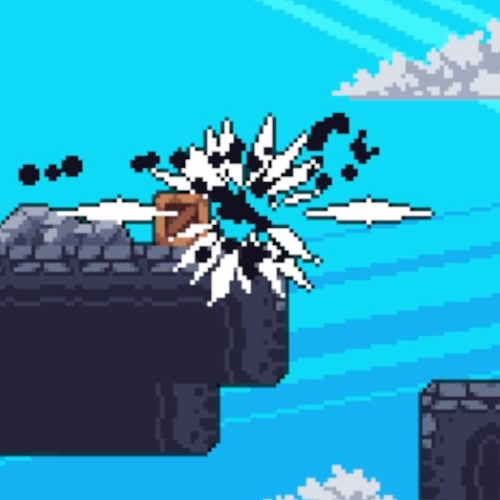

# Ninja Game

<h4> Author: Zane Deso </h4>
<h4> Last Updated: 8/31/2024 </h4>

<h5> Overview </h5>
    

    The purpose of this project was to complete daFluffyPotato pyGame Tutorial (2023) in 2024. Please see past commits to development history. This tutorial covered a many topics including tiles, tilemaps, physics, entities, particles, sparks, camera, parallax effect, enemies, AI, combat, level-editing, level transitions, and making executables.
    

