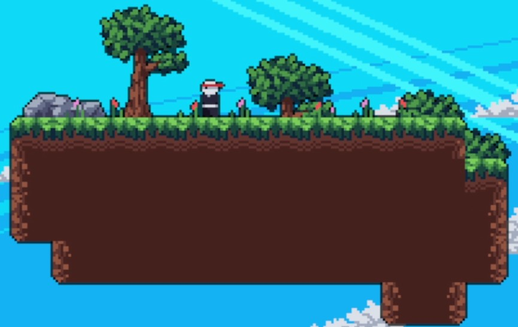
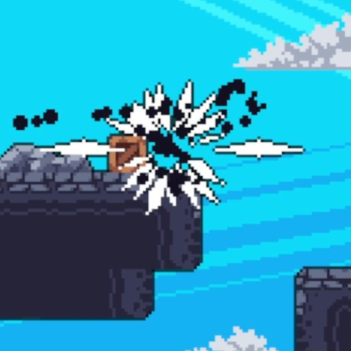

# 🥷 Ninja Game – 2D Platformer in Pygame

**Developer:** Zane Deso  
**Technologies:** Python, Pygame, Object-Oriented Programming (OOP), Game Physics, Collision Detection  

## 🏆 About the Project

**Ninja Game** is a fast-paced 2D platformer built with **Pygame**, showcasing dynamic movement, combat mechanics, and interactive environments. This project demonstrates **game architecture**, **collision detection**, **animation handling**, and **state-based gameplay design**—all key skills in game development.

While inspired by existing tutorials, this project extends beyond the basics with **custom mechanics** and structured, scalable code. It's a foundation for future game expansions, such as AI-driven enemies, advanced physics interactions, and procedural level generation.

---

## 🎮 Features & Mechanics

✅ **Smooth Player Movement** – Directional control with realistic acceleration and deceleration.  
✅ **Jump Physics & Platforming** – Fine-tuned gravity mechanics with variable jump heights.  
✅ **Combat System** – Attack mechanics with hit detection for engaging gameplay.  
✅ **Enemy AI (Basic)** – Simple enemy behavior for interaction and combat.  
✅ **Animation System** – Frame-based sprite animation for fluid character movement.  
✅ **Level Design & Collision Handling** – Tile-based world with obstacle interaction.  

---

## 🛠️ Technologies Used

- **Python & Pygame** – Game engine and framework for rendering, physics, and input handling.  
- **Object-Oriented Design (OOP)** – Modular classes for scalability and readability.  
- **Collision Detection & Physics** – Precise hitbox and terrain interactions.  
- **State Management** – Handling transitions between idle, running, jumping, and attacking.  

---

## 🚀 Potential Enhancements

This project lays the groundwork for future improvements, including:

🔹 **AI Improvements** – Smarter enemy behavior and dynamic difficulty scaling.  
🔹 **Game Loop Optimization** – Performance enhancements for smoother gameplay.  
🔹 **New Mechanics** – Wall climbing, double jumps, or ranged combat.  
🔹 **Sound & Effects** – Immersive audio and particle effects.  
🔹 **Multiplayer Support** – Online or local co-op play.  

---

## 📸 Screenshots

  
  


---

## 📥 Installation & Setup

1️⃣ Clone the repository:  
```bash
git clone https://github.com/zanemilo/Ninja_Game.git
cd Ninja_Game
```
2️⃣ Install dependencies:  
```bash
pip install -r requirements.txt
```
3️⃣ Run the game:  
```bash
python main.py
```

---

## 💡 What This Project Demonstrates

✅ **Game Development Fundamentals** – Core mechanics, UI elements, and physics tuning.  
✅ **Problem-Solving in Python** – Implementing custom logic for movement, interaction, and AI.  
✅ **Scalable Code Structure** – Well-organized OOP for future extensibility.  
✅ **A Passion for Game Development** – Initiative to expand on tutorials and innovate further.  

---

### 📫 Let's Connect!

Interested in **game development**, **Python projects**, or **interactive design**? Feel free to reach out or check out my other projects:

- **GitHub**: [zanemilo](https://github.com/zanemilo)  
- **LinkedIn**: [Zane Deso](https://www.linkedin.com/in/zanedeso/)  

