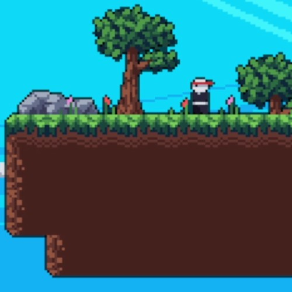

# Ninja Game

<h4> Author: Zane Deso </h4>
<h4> Last Updated: 8/31/2024 </h4>


<h3> Overview </h3>
    <p>
    The purpose of this project was to complete DaFluffyPotato pyGame Tutorial (2023) in 2024. Please see past commits to review development history. This tutorial covered multiple topics to include tiles, tilemaps, physics, entities, particles, sparks, camera, parallax effect, enemies, AI, combat, level-editing, level transitions, and making executables.
    </p>
    <a href="https://youtu.be/2gABYM5M0ww?list=PLX5fBCkxJmm1fPSqgn9gyR3qih8yYLvMj">
    Link to Tutorial by DaFluffyPotato
    </a>
<br>

<h3> Contributions </h3>
    <p>
        <ul>
            <li> Custom smoke particle when player jumps from a tile.
            <li> Added Double jump feature.
            <li> Customized map, using tile editor. Saved and implemented using JSON.
            <li> Adjusted camera smoothing to be less jittery.
            <li> Adjusted wall jump velocity.
            <li> Created read me using HTML tags.
        </ul>
    </p>
<br>

<h3> How to play </h3>
    <p>
    To play Ninja Game, one should simply need to clone the repo to their local device and select the <strong>Ninja Game.exe Shortcut</strong>.
    </p>
    <p>
    Note: A slow load was noticeable on initial boot but afterwards the game runs smoothly.
    </p>
<h4> Controls </h4>
    <p>
        <ul>
            <li> Move: Left and right arrow keys.
            <li> Jump: Up arrow key.
            <li> Dash Attack: X key.
            <li> Wall Slide: Push arrow key in direction of wall.
            <li> Wall Jump: While wall sliding, Up arrow key.
        </ul>
    </p>
<br>

<h6> Character and world </h6>
<br>
<br>


<h6> Dash Particles and hit sparks </h6>
<br>
<br>

<h3> Code Examples </h3>

<h4> Camera Movement Easing</h4>
<p>
The camera in the game follows the player's movement in a way that ramps to the player's location. Effectively this will create a smoother camera transition that gradually slows down as the camera location more closely aligns with the player's lcoation. The code below uses a constant of 24 as a means to divide the distance of the camera's location to the player's location each frame.
</p>

```
self.scroll[0] += (self.player.rect().centerx - self.display.get_width() / 2 - self.scroll[0]) /24
self.scroll[1] += (self.player.rect().centery - self.display.get_height() / 2 - self.scroll[1]) /24
render_scroll = (int(self.scroll[0]), int(self.scroll[1]))
```
<br>

<h4> Sparks Effect </h4>
<p>
The sparks in the game appear during a few instances:
    <ul>
        <li> When an enemy shoots
        <li> When a projectile collides with a tile
        <li> When the player is hit by a projectile
        <li> When a enemy is killed by the player's dash attack
    </ul>
</p>

```
class Spark:
    def __init__(self, pos, angle, speed):
        self.pos = list(pos)
        self.angle = angle
        self.speed = speed

    def update(self):
        self.pos[0] += math.cos(self.angle) * self.speed
        self.pos[1] += math.sin(self.angle) * self.speed

        self.speed = max(0, self.speed -0.1)
        return not self.speed
    
    def render(self, surf, offset=(0, 0)):
        render_points = [
            (self.pos[0] + math.cos(self.angle) * self.speed * 3 - offset[0], self.pos[1] + math.sin(self.angle) * self.speed * 3 - offset[1]),
            (self.pos[0] + math.cos(self.angle + math.pi * 0.5) * self.speed * 0.5 - offset[0], self.pos[1] + math.sin(self.angle + math.pi * 0.5) * self.speed * 0.5 - offset[1]),
            (self.pos[0] + math.cos(self.angle + math.pi) * self.speed * 3 - offset[0], self.pos[1] + math.sin(self.angle + math.pi) * self.speed * 3 - offset[1]),
            (self.pos[0] + math.cos(self.angle - math.pi * 0.5) * self.speed * 0.5 - offset[0], self.pos[1] + math.sin(self.angle - math.pi * 0.5) * self.speed * 0.5 - offset[1]),
        ]

        pygame.draw.polygon(surf, (255, 255, 255), render_points)
```
<h6> Spark Class </h6>
<p>
The Spark class is used to handle creating sparks and updating them each frame. The attributes position, angle and speed help calculate the direction, shape and speed of each spark. The position is updated using cosine and sin functions for the x and y coords of each spark repsectively. The speed slowly decreases to 0 and once it is 0 the spark's update() method returns false signifying that the spark should be removed in main.
</p>
<p>
The render method handles calculating trajectories by applying attributes such as angle, position and speed to functions using pi to change the rotation of the spark's trajectory and altering the x and y coordinates by sending the attributes through cosine and sin functions. Constants are invoked to ensure a level of consistency. 
<br>
<br>

```
if self.tilemap.solid_check(projectile[0]): # if the loc of projectile is a solid tile remove it
                    self.projectiles.remove(projectile)
                    for i in range(4):
                        self.sparks.append(Spark(projectile[0], random.random() - 0.5 + (math.pi if projectile[1] > 0 else 0), 2 + random.random()))
```
<h6> Sparks created when projectile collides with solid tile </h6>
<p>
Each projectile checks if it has collided with a solid tile on the tile map on the x axis, as this is the only directions projectiles will shoot. If the projectile collides with a solid tile, it creates sparks. Randomness to the attributes are calculated at the time a spark is instatiated by using random.random().
</p>
<br>
<br>

```
for spark in self.sparks.copy():
                kill = spark.update()
                spark.render(self.display, offset=render_scroll)
                if kill:
                    self.sparks.remove(spark)
```
<h6> Spark display and removal </h6>
<p>
Each spark that is created is appended to a list in main and then is displayed via this code. The render function for the spark instance is called with parameters of the game's display and including the camera offset. Without the camera offset, the sparks would mis align with where they are meant to be due to the camera moving based on player movement this changes the coordinates needed to calculate location of sparks. Each spark is removed if their respective update method returns false when the sparks speed becomes 0. The way the sparks are removed are by using the remove() method on the list of sparks in main.
</p>

    